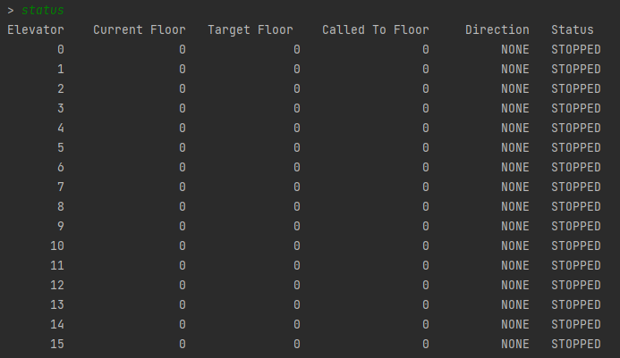

# ElevatorSystem
Program takes 4 commands.
When prompted by ">" u can input commands.

Elevator contains: Elevator id, Current Floor, Target Floor, Called To Floor, Direction and Status.

Available commands:

status - prints out every elevator and its status. Single elevator can be used infinite amount of times after it completes it's planned route. Elevators move up and down as expected.

Usage: simply write "status".

pickup - takes pairs of 2 integers: #1 floor of pickup (calledToFloor), #2 target floor (targerFloor) takes up to 16 pairs. Pair is divided by ":".

Usage: pickup 0:2 1:5 5:2 0:2 [etc. up to 16 pairs]

switch-simulator - choose method of iterating through floors: automatic and manual. Default is automatic. Iterating with manual mode is done with a next command.

Usage: switch-simulator automatic, switch-simulator manual

step - FOR USAGE ONLY WITH AND REQUIRED BY manual mode - enable manual mode by command: "switch-simulator manual".

Usage: step
